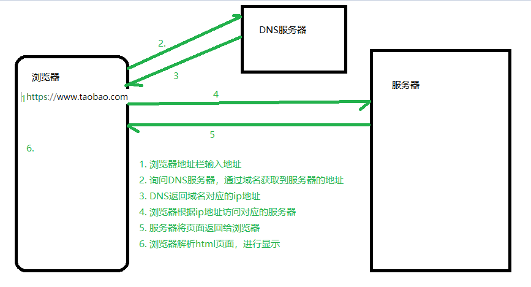

# 基本概念

## 浏览器与服务器的交互流程

1. 浏览器通过地址栏发出**请求**
2. 通过DNS服务器解析，得到域名对应的ip地址
3. 根据ip地址，访问服务器具体的某个文件
4. 服务器响应这个具体的文件
5. 浏览器获取响应，进行显示



问题1：我们写的html页面，存放在哪儿？

问题2：我们写的html页面，在哪里执行（显示）？

前端开发：以浏览器为宿主环境，结合 HTML、CSS、Javascript等技术，而进行的一系列开发，通常称之为**前端开发**。

服务器端开发：HTTP服务器可以结合某一编程语言处理业务逻辑，由此进行的开发，通常称之为**服务端开发**。 

**nodejs：服务端的javascript开发，用于开发服务端程序的**

## 为什么要学习nodejs

为什么要学习服务端的开发？

1. 通过学习Node.js开发理解**服务器开发**、**Web请求和响应过程**、 **了解服务器端如何与客户端配合**
2. 作为前端开发工程师（FE）需要具备一定的服务端开发能力
   + 了解什么是服务端渲染？
   + 了解服务端如何编写接口？
3. 全栈工程师的必经之路


服务器端开发语言有很多，为什么要选择nodejs

1. 降低编程语言切换的成本(nodejs实质上用的还是javascript)
2. NodeJS是前端项目的基础设施，前端项目中用到的大量工具，都是基于nodejs实现的
3. nodejs在处理高并发上有得天独厚的优势
4. **对于前端工程师，面试时对于nodejs有一定的要求**


参考资料：

[Node.js 究竟是什么？](https://www.ibm.com/developerworks/cn/opensource/os-nodejs/)

[为什么要用 Node.js](http://blog.jobbole.com/100058/)

## node.js 是什么？

node.js，也叫作node，或者nodejs，指的都是一个东西。

1. [node.js官方网站](https://nodejs.org/)
2. [node.js中文网](http://nodejs.cn/)
3. [node.js 中文社区](https://cnodejs.org/)


Node.js是一个Javascript运行环境(runtime environment)，发布于2009年5月，由Ryan Dahl开发，实质是对Chrome V8引擎进行了封装。Node.js对一些特殊用例进行优化，提供替代的API，使得V8在非浏览器环境下运行得更好。 

+ Node.js 是一个基于 Chrome V8 引擎的 JavaScript 运行环境。 

```
1. nodejs不是一门新的编程语言，nodejs是在服务端运行javascript的运行环境
2. 运行环境：写得程序想要运行必须要有对应的运行环境
	php代码必须要有apache服务器
	在web端，浏览器就是javascript的运行环境
	在node端，nodejs就是javascript的运行环境
2. javascript并不只是能运行在浏览器端，浏览器端能够运行js是因为浏览器有js解析器，因此只需要有js解析器，任何软件都可以运行js。
3. nodejs可以在服务端运行js，因为nodejs是基于chrome v8的js引擎。
```

+ Node.js 使用了一个事件驱动、非阻塞式 I/O 的模型，使其轻量又高效。  
+ Node.js 的包管理器 npm，是全球最大的开源库生态系统。 

**nodejs的本质：不是一门新的编程语言，nodejs是javascript运行在服务端的运行环境，编程语言还是javascript**

## nodejs与浏览器端js的区别

nodejs是基于chrome v8引擎的，因此nodejs可以和浏览器一样执行js代码，但是二者执行的js还是有一定区别的。


思考：

1. 在浏览器端，可以使用javascript操作文件么？
2. 在nodejs端，可以使用BOM和DOM的方法么？
3. 我们学习nodejs，学习什么内容？ 

## nodejs可以干什么？

1. 开发服务端程
2. 开发命令行工具（CLI），比如npm,webpack,gulp等
3. 开发桌面应用程序（借助 node-webkit、electron 等框架实现）

# 安装nodejs

## nodejs版本

下载地址

- [当前版本](https://nodejs.org/en/download/)
- [历史版本](https://nodejs.org/en/download/releases/)

官网术语解释

- LTS 版本：Long-term Support 版本，长期支持版，即稳定版。
- Current 版本：Latest Features 版本，最新版本，新特性会在该版本中最先加入。

查看node版本

```bash
node -v
```

## 环境变量

当要求系统运行一个**程序** 而没有告诉它程序所在的完整路径时，

1. 首先在**当前目录**中查找和该字符串匹配的可执行文件
2. 进入用户 path 环境变量查找
3. 进入系统 path 环境变量查找

配置环境变量：

```javas
找到环境变量：计算机 --右键--> 属性 --> 高级系统设置 --> 高级 --> 环境变量
```

直接将可执行程序所在目录配置到PATH中

```javascript
//如果是window7操作系统，注意要用分号;隔开，不要覆盖原来的内容
D:\Program Files\feiq
```

# 运行nodejs程序

## 方式一：REPL介绍

1. REPL 全称: Read-Eval-Print-Loop（交互式解释器）
   - R 读取 - 读取用户输入，解析输入了Javascript 数据结构并存储在内存中。
   - E 执行 - 执行输入的数据结构
   - P 打印 - 输出结果
   - L 循环 - 循环操作以上步骤直到用户两次按下 ctrl-c 按钮退出。
2. 在REPL中编写程序 （类似于浏览器开发人员工具中的控制台功能）
   - 直接在控制台输入 `node` 命令进入 REPL 环境
3. 按两次 Control + C 退出REPL界面 或者 输入 `.exit` 退出 REPL 界面
   - 按住 control 键不要放开, 然后按两下 c 键

## 方式二：使用node执行js文件

+ 创建js文件 `helloworld.js`

- 写nodejs的内容：`console.log('hello nodejs')`
- 打开命令窗口 `cmd`
  - shift加右键打开命令窗口，执行 `node 文件名.js`即可
  - 给vscode安装`terminal`插件，直接在vscode中执行
- 执行命令：`node helloworld.js`


注意：在nodejs中是无法使用DOM和BOM的内容的，因此`document, window`等内容是无法使用的。

# global模块-全局变量

JavaScript 中有一个特殊的对象，称为全局对象（Global Object），它及其所有属性都可以在程序的任何地方访问，即全局变量。

在浏览器 JavaScript 中，通常 window 是全局对象， 而 Node.js 中的全局对象是 `global`，所有全局变量（除了 global 本身以外）都是 global 对象的属性。

在 Node.js 我们可以直接访问到 global 的属性，而不需要在应用中包含它。

常用的global属性

```javascript
console: 用于打印日志
setTimeout/clearTimeout: 设置清除延时器
setInterval/clearInterval: 设置清除定时器

__dirname: 当前文件的路径，不包括文件名
__filename： 获取当前文件的路径，包括文件名

//与模块化相关的，模块化的时候会用到
require
exports
module
```

# fs模块
> fs模块是nodejs中最常用的一个模块，因此掌握fs模块非常的有必要，fs模块的方法非常多,用到了哪个查哪个即可。
>
> 文档地址：http://nodejs.cn/api/fs.html

  在nodejs中，提供了fs模块，这是node的核心模块

  注意：

1. 除了global模块中的内容可以直接使用，其他模块都是需要加载的。
2. fs模块不是全局的，不能直接使用。因此需要导入才能使用。

```javascript
var fs = require("fs");
```

## 读取文件

> 语法：fs.readFile(path[, options], callback)

方式一：不传编码参数

```javascript
//参数1： 文件的名字
//参数2： 读取文件的回调函数
  //参数1：错误对象，如果读取失败，err会包含错误信息，如果读取成功，err是null
  //参数2：读取成功后的数据（是一个Buffer对象）
fs.readFile("data.txt", function(err, data){
  console.log(err);
  console.log(data);
});
```

方式二：传编码参数

```javascript
//参数1： 文件的路径
//参数2： 编码，如果设置了，返回一个字符串，如果没有设置，会返回一个buffer对象
//参数3： 回调函数
fs.readFile("data.txt", "utf8",function(err, data){
  console.log(err);
  console.log(data);
});
```

关于Buffer对象

```javascript
1. Buffer对象是Nodejs用于处理二进制数据的。
2. 其实任意的数据在计算机底层都是二进制数据，因为计算机只认识二进制。
3. 所以读取任意的文件，返回的结果都是二进制数据，即Buffer对象
4. Buffer对象可以调用toString()方法转换成字符串。
```

## 写文件

> 语法：fs.writeFile(file, data[, options], callback)

```javascript
//参数1：写入的文件名(如果文件不存在，会自动创建)
//参数2：写入的文件内容（注意：写入的内容会覆盖以前的内容）
//参数3：写文件后的回调函数
fs.writeFile("2.txt", "hello world, 我是一个中国人", function(err){
  if(err) {
    return console.log("写入文件失败", err);
  }
  console.log("写入文件成功");
});
```

注意：

1. 写文件的时候，会把原来的内容给覆盖掉

## 追加文件

> 语法：fs.appendFile(path, data[, options], callback)

```javascript
//参数1：追加的文件名(如果文件不存在，会自动创建)
//参数2：追加的文件内容（注意：写入的内容会覆盖以前的内容）
//参数3：追加文件后的回调函数
fs.appendFile("2.txt", "我是追加的内容", function(err){
  if(err) {
    return console.log("追加文件内容失败");
  }
  console.log("追加文件内容成功");
})
```

思考：如果没有appendFile，通过readFile与writeFile应该怎么实现？

## 文件同步与异步的说明

> fs中所有的文件操作，都提供了异步和同步两种方式

异步方式：不会阻塞代码的执行

```javascript
//异步方式
var fs = require("fs");

console.log(111);
fs.readFile("2.txt", "utf8", function(err, data){
  if(err) {
    return console.log("读取文件失败", err);
  }
  console.log(data);
});
console.log("222");
```

同步方式：会阻塞代码的执行

```javascript
//同步方式
console.log(111);
var result = fs.readFileSync("2.txt", "utf-8");
console.log(result);
console.log(222);
```

总结：同步操作使用虽然简单，但是会影响性能，因此尽量使用异步方法，尤其是在工作过程中。

## 其他api（了解）

方法有很多，但是用起来都非常的简单，学会查文档

文档：http://nodejs.cn/api/fs.html

| 方法名                                  | 描述                   |
| --------------------------------------- | ---------------------- |
| `fs.readFile(path, callback)`           | 读取文件内容（异步）   |
| `fs.readFileSync(path)`                 | 读取文件内容（同步）   |
| `fs.writeFile(path, data, callback)`    | 写入文件内容（异步）   |
| `fs.writeFileSync(path, data)`          | 写入文件内容（同步）   |
| `fs.appendFile(path, data, callback)`   | 追加文件内容（异步）   |
| `fs.appendFileSync(path, data)`         | 追加文件内容（同步）   |
| `fs.rename(oldPath, newPath, callback)` | 重命名文件（异步）     |
| `fs.renameSync(oldPath, newPath)`       | 重命名文件（同步）     |
| `fs.unlink(path, callback)`             | 删除文件（异步）       |
| `fs.unlinkSync(path)`                   | 删除文件（同步）       |
| `fs.mkdir(path, mode, callback)`        | 创建文件夹（异步）     |
| `fs.mkdirSync(path, mode)`              | 创建文件夹（同步）     |
| `fs.rmdir(path, callback)`              | 删除文件夹（异步）     |
| `fs.rmdirSync(path)`                    | 删除文件夹（同步）     |
| `fs.readdir(path, option, callback)`    | 读取文件夹内容（异步） |
| `fs.readdirSync(path, option)`          | 读取文件夹内容（同步） |
| `fs.stat(path, callback)`               | 查看文件状态（异步）   |
| `fs.statSync(path)`                     | 查看文件状态（同步）   |

# path模块

## 路径操作的问题

在读写文件的时候，文件路径可以写相对路径或者绝对路径

```javascript
//data.txt是相对路径，读取当前目录下的data.txt, 相对路径相对的是指向node命令的路径
//如果node命令不是在当前目录下执行就会报错， 在当前执行node命令的目录下查找data.txt，找不到
fs.readFile("data.txt", "utf8", function(err, data) {
  if(err) {
    console.log("读取文件失败", err);
  }

  console.log(data);
});
```

相对路径：相对于执行node命令的路径

绝对路径：`__dirname`: 当前文件的目录，`__filename`: 当前文件的目录，包含文件名

## path模块的常用方法

> 关于路径，在linux系统中，路径分隔符使用的是`/`，但是在windows系统中，路径使用的`\`

在我们拼写路径的时候会带来很多的麻烦，经常会出现windows下写的代码，在linux操作系统下执行不了，path模块就是为了解决这个问题而存在的。

常用方法：

```javascript
path.join();//拼接路径

//windows系统下
> path.join("abc","def","gg", "index.html")
"abc\def\gg\a.html"

//linux系统下
> path.join("abc","def","gg", "index.html")
'abc/def/gg/index.html'

path.basename(path[, ext])	返回文件的最后一部分
path.dirname(path)	返回路径的目录名
path.extname(path)	获取路径的扩展名

var path = require("path");
var temp = "abc\\def\\gg\\a.html";
console.log(path.basename(temp));//a.html
console.log(path.dirname(temp));//abc\def\gg
console.log(path.extname(temp));//.html
```

【优化读写文件的代码】

## path模块其他api（了解）

| 方法名                       | 描述                                 |
| ---------------------------- | ------------------------------------ |
| `path.basename(path[, ext])` | 返回文件的最后一部分                 |
| `path.dirname(path)`         | 返回路径的目录名                     |
| `path.extname(path)`         | 获取路径的扩展名                     |
| `path.isAbsolute(path)`      | 判断目录是否是绝对路径               |
| `path.join([...paths])`      | 将所有的path片段拼接成一个规范的路径 |
| `path.normalize(path)`       | 规范化路径                           |
| `path.parse(path)`           | 将一个路径解析成一个path对象         |
| `path.format(pathObj)`       | 讲一个path对象解析成一个规范的路径   |

# http模块

## 创建服务器基本步骤

```javascript
//1. 导入http模块，http模块是node的核心模块，作用是用来创建http服务器的。
var http = require("http");

//2. 创建服务器
var server = http.createServer();

//3. 服务器处理请求
server.on("request", function() {
  console.log("我接收到请求了");
});

//4. 启动服务器，监听某个端口
server.listen(9999, function(){
  console.log("服务器启动成功了, 请访问： http://localhost:9999");
});
```

详细说明

1. 给服务器注册request事件，只要服务器接收到了客户端的请求，就会触发request事件
2. request事件有两个参数，request表示请求对象，可以获取所有与请求相关的信息，response是响应对象，可以获取所有与响应相关的信息。
3. 服务器监听的端口范围为：1-65535之间，推荐使用3000以上的端口，因为3000以下的端口一般留给系统使用

## request对象详解

文档地址：http://nodejs.cn/api/http.html#http_message_headers

常见属性：

```javascript
headers: 所有的请求头信息
method： 请求的方式
rawHeaders： 所有的请求头信息（数组的方式）
url： 请求的地址
```

注意：在发送请求的时候，可能会出现两次请求的情况，这是因为谷歌浏览器会自动增加一个`favicon.ico`的请求。

小结：request对象中，常用的就是method和url两个参数

## response对象详解

文档地址：http://nodejs.cn/api/http.html#http_class_http_serverresponse

常见的属性和方法：

```javascript
res.write(data): 给浏览器发送请求体，可以调用多次，从而提供连续的请求体
res.end();   通知服务器，所有响应头和响应主体都已被发送，即服务器将其视为已完成。
res.end(data); 结束请求，并且响应一段内容，相当于res.write(data) + res.end()
res.statusCode: 响应的的状态码 200 404 500
res.statusMessage: 响应的状态信息， OK Not Found ,会根据statusCode自动设置。
res.setHeader(name, value); 设置响应头信息， 比如content-type
res.writeHead(statusCode, statusMessage, options); 设置响应头，同时可以设置状态码和状态信息。
```

**注意：必须先设置响应头，才能设置响应。** 

## 根据不同请求输出不同响应数据

- [request.url](http://nodejs.cn/api/http.html#http_message_url)
- `req.url`：获取请求路径
  - 例如：请求`http://127.0.0.1:3000/index` 获取到的是：`/index`
  - 例如：请求`http://127.0.0.1:3000/` 获取到的是：`/`
  - 例如：请求`http://127.0.0.1:3000` 获取到的是：`/`

## 服务器响应文件

- 注意：浏览器中输入的URL地址，仅仅是一个标识，不与服务器中的目录一致。也就是说：返回什么内容是由服务端的逻辑决定

```js
server.on('request', function(req, res) {
  var url = req.url
  if(url === '/') {
    fs.readFile('./index.html', function(err, data) {
      if(err) {
        return res.end('您访问的资源不存在~')
      }

      res.end(data)
    })
  }
})
```

## 模拟Apache服务器

- 根据 `req.url` 读取不同的页面内容，返回给浏览器

## MIME类型

- MIME(Multipurpose Internet Mail Extensions)多用途Internet邮件扩展类型 是一种表示文档性质和格式的标准化方式
- 浏览器通常使用MIME类型（而不是文件扩展名）来确定如何处理文档；因此服务器将正确的MIME类型附加到响应对象的头部是非常重要的
- [MIME 类型](https://developer.mozilla.org/zh-CN/docs/Web/HTTP/Basics_of_HTTP/MIME_Types)

### mime模块

- 作用：获取文件的MIME类型
- 安装：`npm i mime`

```js
var mime = require('mime')

// 获取路径对应的MIME类型
mime.getType('txt')                    // ⇨ 'text/plain'
// 根据MIME获取到文件后缀名
mime.getExtension('text/plain')        // ⇨ 'txt'
```

